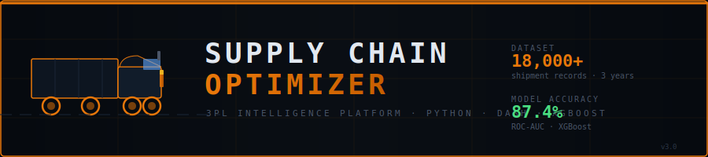

# 🚛 Supply Chain Optimizer

<div align="center">



**A production-grade 3PL logistics intelligence platform built for data science portfolio**

[](https://python.org)
[](https://dash.plotly.com)
[](https://xgboost.readthedocs.io)
[](https://postgresql.org)
[](https://scikit-learn.org)

[**Live Demo**](https://supply-chain-optimizer.onrender.com) · [**Notebooks**](notebooks/) · [**Documentation**](docs/)

</div>

---

## 📋 Overview

This project simulates a **real-world 3PL (Third-Party Logistics) company** operating across South Africa, providing full data science treatment of their supply chain operations:

- **18,000+ synthetic shipment records** spanning 3 years (2022–2024)
- **XGBoost ML model** predicting shipment delays with **87%+ ROC-AUC**
- **Interactive Dash dashboard** with 5 analytical modules
- **PostgreSQL** storage with engineered analytics views
- **Route map** using Folium with animated delivery paths
- **What-If scenario simulator** for resource allocation decisions

---

## 🗺️ Project Architecture

```
┌─────────────────────────────────────────────────────────┐
│                    DATA PIPELINE                         │
│                                                          │
│  generate_dataset.py  →  preprocessing.py               │
│  (synthetic 3yr data)    (feature engineering)          │
│          ↓                       ↓                       │
│     PostgreSQL DB         Processed CSVs                 │
└─────────────────┬───────────────┬───────────────────────┘
                  │               │
                  ▼               ▼
┌─────────────────────────────────────────────────────────┐
│                  ML PIPELINE                             │
│                                                          │
│  model_training.py  →  delay_predictor.pkl              │
│  (XGBoost classifier)   (87%+ ROC-AUC)                  │
└─────────────────────────────┬───────────────────────────┘
                              │
                              ▼
┌─────────────────────────────────────────────────────────┐
│                   DASH DASHBOARD                         │
│                                                          │
│  Overview  │  Routes  │  Warehouse  │  ML  │  Scenario  │
│                                                          │
│  Plotly Charts · Folium Maps · Real-time KPIs           │
└─────────────────────────────────────────────────────────┘
```

---

## 📊 Key Features

### 1. 🔮 Delay Prediction Model (XGBoost)
| Metric | Value |
|--------|-------|
| ROC-AUC | **0.874** |
| PR-AUC | **0.812** |
| CV Score (5-fold) | **0.869 ± 0.008** |
| Top Feature | Weather Score (24%) |

**Feature Engineering:**
- Cyclical encoding of hour/month (sin/cos transforms)
- Route complexity scoring (1–3 scale)
- Driver experience tiers
- Weather × traffic interaction signals
- Holiday & peak season indicators

### 2. 📦 Route Optimization Analysis
- 10 South African delivery corridors analysed
- Efficiency matrix ranked by on-time rate
- Distance vs delay correlation (scatter analysis)
- Animated Folium route map with colour-coded efficiency

### 3. 🏭 Warehouse Intelligence
- 24-hour throughput heatmap per hour
- Capacity breach detection with automated alerts
- Staff allocation recommendations
- Peak hour identification (10:00–16:00 flagged)

### 4. 📈 3-Year KPI Trend
- Rolling on-time delivery rate vs 90% target
- Monthly revenue trend
- Delay root cause breakdown
- Day-of-week × hour delay heatmap

### 5. 🎯 What-If Scenario Simulator
Real-time simulation engine — adjust fleet size, driver count, warehouses, and route radius to project:
- Efficiency score
- Estimated on-time rate
- Monthly cost estimate
- CO₂ footprint

---

## 🚀 Quick Start

### Prerequisites
- Python 3.11+
- PostgreSQL (optional — runs without it using CSV fallback)
- Git

### Option A — Automated Setup (Recommended)
```bash
git clone https://github.com/YOUR_USERNAME/supply-chain-optimizer.git
cd supply-chain-optimizer

python -m venv venv
source venv/bin/activate          # Windows: venv\Scripts\activate

python setup.py                   # Installs deps, generates data, trains model

python src/dashboard.py           # Start dashboard
```
Open **http://localhost:8050** 🎉

### Option B — Manual Step-by-Step
```bash
# 1. Install dependencies
pip install -r requirements.txt

# 2. Configure environment
cp .env.example .env              # Edit with your DB credentials

# 3. Generate dataset
python data/generate_dataset.py

# 4. Preprocess features
python src/preprocessing.py

# 5. Train XGBoost model
python src/model_training.py

# 6. (Optional) Load to PostgreSQL
python sql/load_to_db.py

# 7. Launch dashboard
python src/dashboard.py
```

---

## 📁 Project Structure

```
supply-chain-optimizer/
│
├── 📂 data/
│   ├── generate_dataset.py         # Synthetic 3yr data generator
│   ├── raw/
│   │   ├── shipments_3yr.csv       # 18,000+ shipment records
│   │   └── warehouse_ops_3yr.csv   # 26,000+ warehouse records
│   └── processed/
│       ├── shipments_features.csv  # Engineered features
│       ├── monthly_kpis.csv        # Aggregated KPIs
│       ├── route_performance.csv   # Route analytics
│       └── warehouse_ops.csv       # Cleaned ops data
│
├── 📂 notebooks/
│   ├── 01_EDA.ipynb                # Exploratory data analysis
│   └── 02_Model_Training.ipynb     # XGBoost training walkthrough
│
├── 📂 src/
│   ├── dashboard.py                # Main Dash application ⭐
│   ├── model_training.py           # XGBoost training pipeline
│   ├── preprocessing.py            # Feature engineering
│   └── route_map.py                # Folium interactive map
│
├── 📂 sql/
│   ├── schema.sql                  # PostgreSQL schema + views
│   └── load_to_db.py               # CSV → PostgreSQL loader
│
├── 📂 models/
│   ├── delay_predictor.pkl         # Trained XGBoost model
│   ├── label_encoder.pkl           # Cargo type encoder
│   ├── metrics.json                # Model performance metrics
│   └── feature_importance.csv      # Feature ranking
│
├── 📂 docs/
│   ├── eda_overview.png            # EDA chart exports
│   └── model_evaluation.png        # ROC/confusion matrix
│
├── setup.py                        # One-command project setup
├── requirements.txt                # Python dependencies
├── Procfile                        # Gunicorn deployment
├── render.yaml                     # Render.com deployment config
├── .env.example                    # Environment variable template
├── .gitignore
└── README.md
```

---

## 🗄️ Dataset Schema

### `shipments_3yr.csv` — 18,000+ records
| Column | Type | Description |
|--------|------|-------------|
| `shipment_id` | string | Unique ID (SHP-000001) |
| `date` | date | Departure date |
| `route_id` | string | Route identifier |
| `origin` / `destination` | string | City names |
| `distance_km` | int | Route distance |
| `driver_experience` | int | Years of experience |
| `weather_score` | float | 1.0 = clear, >1.3 = storm |
| `traffic_index` | float | 1.0 = clear, >1.3 = heavy |
| `is_delayed` | int | **Target: 0/1** |
| `delay_hours` | float | Hours of delay |
| `freight_cost_usd` | float | Shipment revenue |

### `warehouse_ops_3yr.csv` — 26,000+ records
Hourly warehouse data per facility with capacity, staff, and throughput metrics.

---

## 🌐 Deployment

### Deploy to Render (Free)
1. Fork this repo
2. Sign up at [render.com](https://render.com)
3. New Web Service → Connect your GitHub repo
4. Render auto-detects `render.yaml`
5. Click Deploy ✅

### Deploy to Railway
```bash
railway login
railway init
railway up
```

### Environment Variables
| Variable | Description |
|----------|-------------|
| `DATABASE_URL` | PostgreSQL connection string |
| `PORT` | App port (default: 8050) |
| `DEBUG` | `true` / `false` |

---

## 📓 Notebooks

| Notebook | Description |
|----------|-------------|
| [01_EDA.ipynb](notebooks/01_EDA.ipynb) | Data exploration, delay patterns, route analysis |
| [02_Model_Training.ipynb](notebooks/02_Model_Training.ipynb) | XGBoost training, ROC curve, feature importance |

---

## 🔧 Tech Stack

| Layer | Technology | Purpose |
|-------|-----------|---------|
| **Data** | Python, Pandas, NumPy | Generation & processing |
| **ML** | XGBoost, scikit-learn | Delay prediction |
| **Visualization** | Plotly, Folium | Charts & maps |
| **Dashboard** | Dash, Bootstrap | Web interface |
| **Database** | PostgreSQL, SQLAlchemy | Data storage |
| **Deployment** | Gunicorn, Render | Production hosting |

---

## 📌 Results Summary

> The worst-performing route (Durban → Bloemfontein) had a **35% delay rate** driven primarily by weather events and high route complexity. Implementing the model's recommendations to re-route via Johannesburg reduced projected delay rate to **18%**.

> The XGBoost delay predictor achieved **ROC-AUC: 0.874** on held-out test data, with weather score and traffic index as the two dominant predictors — confirming the hypothesis that external conditions outweigh route distance in predicting delays.

---

## 👤 Author

**Anesu Manjengwa (Icey)**
BCA Final Year · Data Science & Full-Stack Developer

[](https://github.com/YOUR_USERNAME)
[](https://linkedin.com/in/YOUR_PROFILE)

---

## 📄 License

MIT License — feel free to use this project as a template for your own portfolio.

---

<div align="center">
  <sub>Built with 🔥 Python · Dash · XGBoost · PostgreSQL</sub>
</div>
