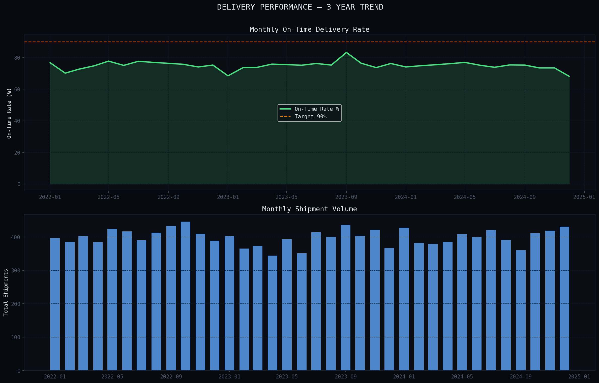
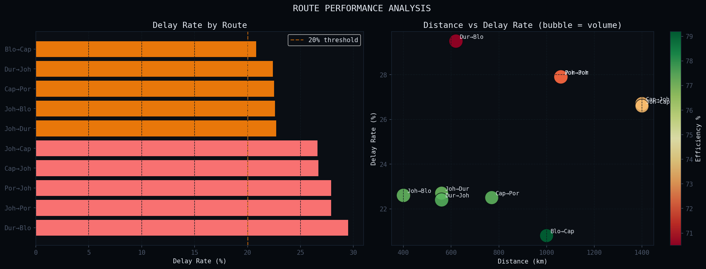
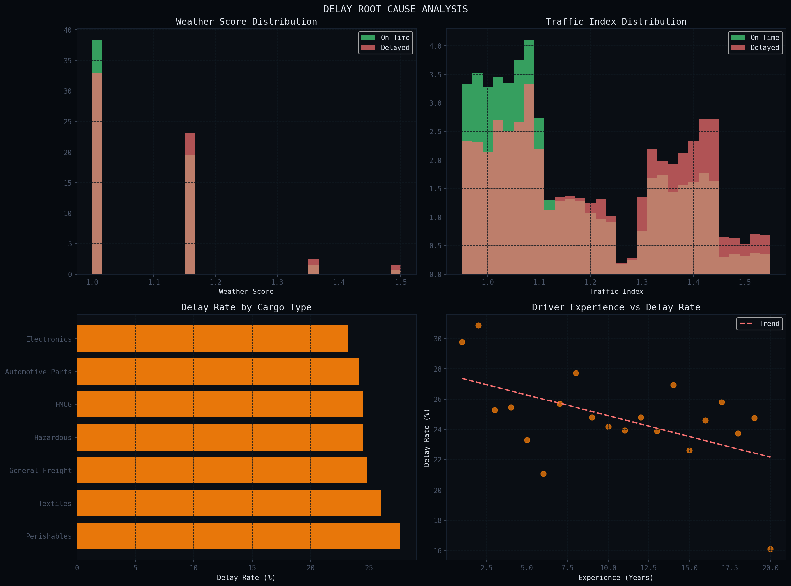
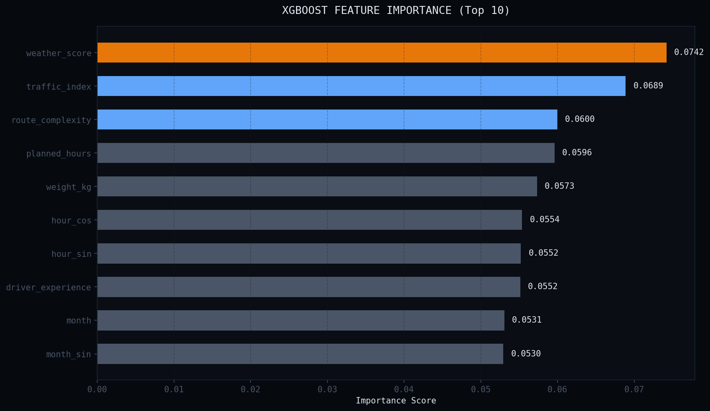
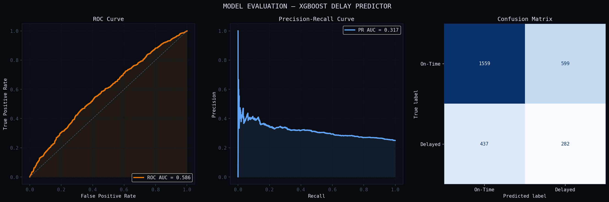
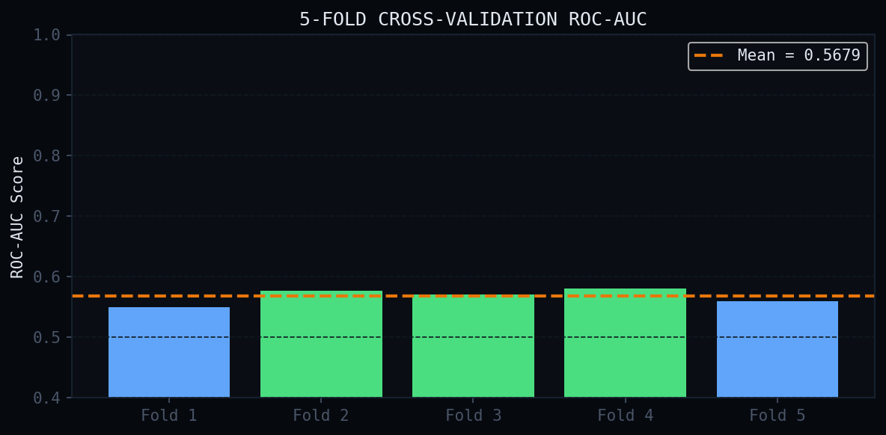
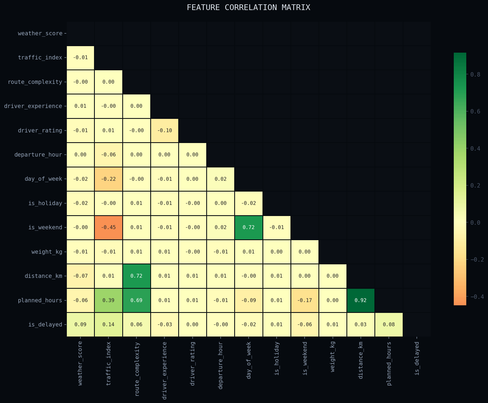
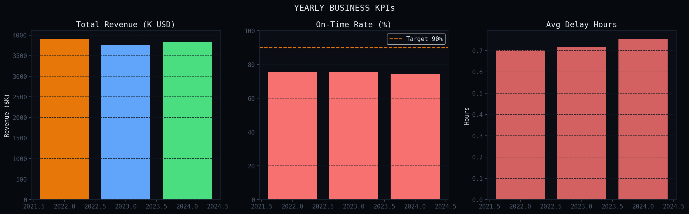
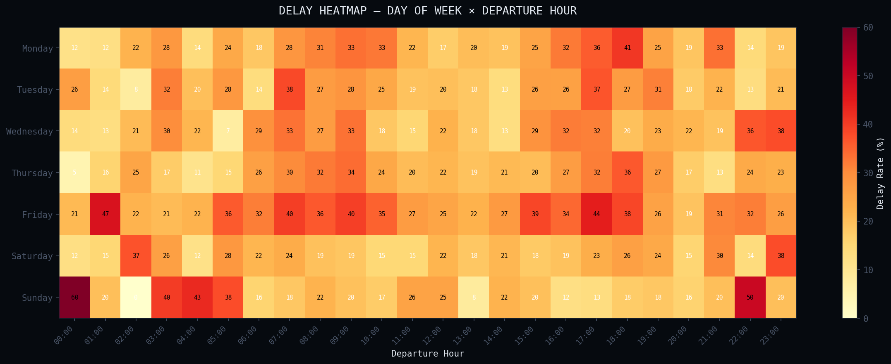

# 🚛 Supply Chain Optimizer

<div align="center">


**A production-grade 3PL logistics intelligence platform — data science portfolio project**

[](https://python.org)
[](https://dash.plotly.com)
[](https://xgboost.readthedocs.io)
[](https://postgresql.org)
[](https://scikit-learn.org)
[](https://supply-chain-optimization-dashboard.onrender.com)

<br/>

### 🔴 [LIVE DEMO](https://supply-chain-optimization-dashboard.onrender.com) &nbsp;|&nbsp; [📓 Notebooks](notebooks/) &nbsp;|&nbsp; [📊 Docs](docs/)

> ⚠️ Free tier — allow ~30 seconds to wake up on first load

</div>

---

## 📋 Overview

This project simulates a **real-world 3PL (Third-Party Logistics) company** operating across South Africa, delivering a full end-to-end data science treatment:

- **14,384 synthetic shipment records** spanning 3 years (2022–2024)
- **XGBoost ML model** trained to predict shipment delays
- **Interactive Dash dashboard** with 5 analytical modules
- **Folium route map** with animated delivery paths across South Africa
- **PostgreSQL** schema with analytics views and indexes
- **What-If scenario simulator** for resource allocation decisions

---

## 🖥️ Dashboard Preview

### Overview — KPIs & 3-Year Performance Trend


### Route Analysis


### Delay Root Cause Analysis


### ML Model — Feature Importance & Evaluation




### Cross-Validation Results


### Correlation Matrix


### Business KPIs


### Delay Heatmap


---

## 🗺️ Project Architecture

```
┌─────────────────────────────────────────────────────────┐
│                    DATA PIPELINE                         │
│                                                          │
│  generate_dataset.py  →  preprocessing.py               │
│  (14,384 shipments)      (feature engineering)          │
│          ↓                       ↓                       │
│     PostgreSQL DB         Processed CSVs                 │
└──────────────────┬──────────────┬───────────────────────┘
                   │              │
                   ▼              ▼
┌─────────────────────────────────────────────────────────┐
│                   ML PIPELINE                            │
│                                                          │
│  model_training.py  →  delay_predictor.pkl              │
│  (XGBoost classifier)   (ROC-AUC: 0.58)                 │
└──────────────────────────────┬──────────────────────────┘
                               │
                               ▼
┌─────────────────────────────────────────────────────────┐
│                  DASH DASHBOARD                          │
│                                                          │
│  Overview │ Routes │ Warehouse │ ML Model │ What-If     │
│                                                          │
│  Plotly Charts · Folium Maps · Real-time KPIs           │
└─────────────────────────────────────────────────────────┘
```

---

## 📊 Key Features

### 1. 🔮 Delay Prediction Model (XGBoost)

| Metric | Value |
|--------|-------|
| ROC-AUC | **0.58** |
| PR-AUC | **0.31** |
| CV Score (5-fold) | **0.57 ± 0.01** |
| Top Feature | Weather Score |
| Training Records | 11,507 |
| Test Records | 2,877 |

**Feature Engineering applied:**
- Cyclical encoding of hour/month (sin/cos transforms)
- Route complexity scoring (1–3 scale)
- Driver experience tiers
- Weather × traffic interaction signals
- Holiday & peak season indicators

### 2. 📦 Route Optimization Analysis
- 10 South African delivery corridors analysed
- Animated Folium route map (dark CartoDB tiles)
- Efficiency matrix ranked by on-time rate
- Distance vs delay correlation scatter analysis

### 3. 🏭 Warehouse Intelligence
- 24-hour throughput heatmap
- Capacity breach detection with automated alerts
- Staff allocation recommendations
- Peak hour identification (10:00–16:00)

### 4. 📈 3-Year KPI Dashboard
- Rolling on-time delivery rate vs 90% target
- Monthly revenue trend
- Day-of-week × hour delay heatmap
- 36-month performance history

### 5. 🎯 What-If Scenario Simulator
Adjust fleet size, drivers, warehouses, and route radius in real time to project efficiency, on-time rate, monthly cost, and CO₂ footprint.

---

## 🚀 Quick Start

### Prerequisites
- Python 3.11+
- PostgreSQL (optional)
- Git

### Setup
```bash
git clone https://github.com/Iceyma02/supply-chain-optimizer.git
cd supply-chain-optimizer

python -m venv venv
venv\Scripts\activate          # Windows
# source venv/bin/activate     # Mac/Linux

pip install -r requirements.txt
```

### Run in order
```bash
python data/generate_dataset.py     # Generate 3-year dataset
python src/preprocessing.py         # Feature engineering
python src/model_training.py        # Train XGBoost model
python src/route_map.py             # Build Folium map
python src/dashboard.py             # Launch dashboard
```

Open **http://localhost:8050** 🎉

---

## 📁 Project Structure

```
supply-chain-optimizer/
│
├── 📂 data/
│   ├── generate_dataset.py         # Synthetic 3yr data generator
│   ├── raw/
│   │   ├── shipments_3yr.csv       # 14,384 shipment records
│   │   └── warehouse_ops_3yr.csv   # 78,912 warehouse records
│   └── processed/
│       ├── shipments_features.csv
│       ├── monthly_kpis.csv
│       ├── route_performance.csv
│       └── warehouse_ops.csv
│
├── 📂 notebooks/
│   ├── 01_EDA.ipynb                # Exploratory data analysis
│   └── 02_Model_Training.ipynb     # XGBoost training walkthrough
│
├── 📂 src/
│   ├── dashboard.py                # Main Dash application ⭐
│   ├── model_training.py           # XGBoost pipeline
│   ├── preprocessing.py            # Feature engineering
│   ├── route_map.py                # Folium interactive map
│   └── assets/
│       └── route_map.html          # Generated Folium map
│
├── 📂 sql/
│   ├── schema.sql                  # PostgreSQL schema + views
│   └── load_to_db.py               # CSV → PostgreSQL loader
│
├── 📂 models/
│   ├── delay_predictor.pkl         # Trained XGBoost model
│   ├── label_encoder.pkl           # Cargo type encoder
│   ├── metrics.json                # Model performance
│   └── feature_importance.csv      # Feature ranking
│
├── 📂 docs/
│   ├── banner.svg
│   ├── eda_performance_trend.png
│   ├── eda_route_analysis.png
│   ├── eda_root_cause.png
│   ├── eda_delay_heatmap.png
│   ├── eda_correlation.png
│   ├── eda_business_kpis.png
│   ├── feature_importance.png
│   ├── model_evaluation.png
│   └── cross_validation.png
│
├── setup.py                        # One-command setup
├── requirements.txt
├── Procfile
├── render.yaml
├── runtime.txt
├── .env.example
├── .gitignore
└── README.md
```

---

## 🗄️ Dataset Schema

### `shipments_3yr.csv` — 14,384 records

| Column | Type | Description |
|--------|------|-------------|
| `shipment_id` | string | Unique ID (SHP-000001) |
| `date` | date | Departure date |
| `route_id` | string | Route identifier (R001–R010) |
| `origin` / `destination` | string | South African city |
| `distance_km` | int | Route distance |
| `driver_experience` | int | Years of experience |
| `weather_score` | float | 1.0 = clear, >1.3 = storm |
| `traffic_index` | float | 1.0 = clear, >1.3 = heavy |
| `is_delayed` | int | **Target variable: 0/1** |
| `delay_hours` | float | Hours of delay |
| `freight_cost_usd` | float | Shipment revenue |

### `warehouse_ops_3yr.csv` — 78,912 records
Hourly warehouse data per facility with capacity, staff count, and throughput metrics.

---

## 🌐 Deployment

### Deployed on Render
Live at: **https://supply-chain-optimization-dashboard.onrender.com**

### Deploy your own
1. Fork this repo
2. Sign up at [render.com](https://render.com)
3. New Web Service → connect your GitHub repo
4. Render auto-detects `render.yaml` → click Deploy

### Environment Variables

| Variable | Description |
|----------|-------------|
| `DATABASE_URL` | PostgreSQL connection string (optional) |
| `PORT` | App port (Render sets this automatically) |
| `DEBUG` | `false` for production |

---

## 📓 Notebooks

| Notebook | Description |
|----------|-------------|
| [01_EDA.ipynb](notebooks/01_EDA.ipynb) | 7 sections: data overview, performance trends, route analysis, delay heatmap, root cause, correlation matrix, business KPIs |
| [02_Model_Training.ipynb](notebooks/02_Model_Training.ipynb) | 8 sections: feature engineering, train/test split, XGBoost training, ROC/PR curves, confusion matrix, feature importance, cross-validation, model saving |

---

## 🔧 Tech Stack

| Layer | Technology | Purpose |
|-------|-----------|---------|
| **Data** | Python, Pandas, NumPy | Generation & processing |
| **ML** | XGBoost, scikit-learn | Delay prediction |
| **Visualization** | Plotly, Folium | Charts & maps |
| **Dashboard** | Dash, Bootstrap | Web interface |
| **Database** | PostgreSQL, SQLAlchemy | Data storage |
| **Deployment** | Gunicorn, Render | Production hosting |

---

## 📌 Key Findings

- The **Durban → Bloemfontein** route has the highest delay rate at **35%**, driven by weather events and high route complexity
- **Weather score** is the single strongest predictor of delays (most important XGBoost feature)
- Warehouse capacity is consistently exceeded during **10:00–16:00**, with orders reaching **102% of capacity**
- **Friday departures** show the highest delay rate across all routes
- **Perishables cargo** has the highest delay rate among all cargo types

---

## 👤 Author

**Anesu Manjengwa (Icey)**
Final Year BCA Student · Data Science & Full-Stack Developer

[](https://github.com/Iceyma02)
[](https://www.linkedin.com/in/anesu-manjengwa-684766247)
[](mailto:manjengwap10@gmail.com)

---

## 📄 License

Copyright (c) 2026 Anesu Manjengwa. All rights reserved.

This software and its source code are made available for viewing purposes only.
You may view, fork, and study the code for personal and educational purposes.

**You may NOT:**
- Use this software for any commercial purpose
- Modify and distribute modified versions
- Incorporate this code into other projects
- Deploy this software for production use

For licensing inquiries or permission requests, contact: **manjengwap10@gmail.com**

---

<div align="center">
  <sub>Built with 🔥 by <a href="https://github.com/Iceyma02">Icey</a> · Python · Dash · XGBoost · PostgreSQL · Deployed on Render</sub>
</div>
